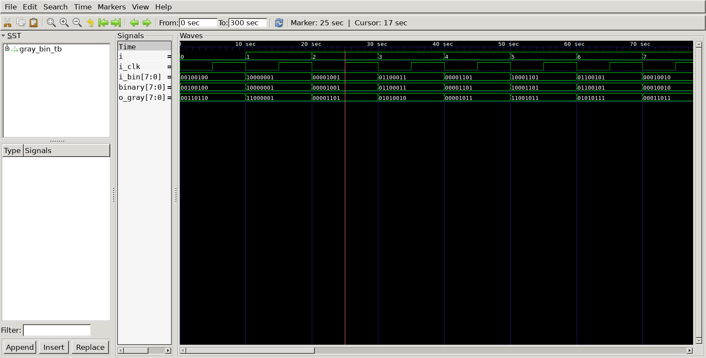

# Gray Code Converter
## Operation Principle
- Bin -> Gray
	- G[N-1] = B[N-1]
	- G[i] = B[i] ^ B[i+1]

- Gray -> Bin
	- B[N-1] = G[N-1]
	- B[i] = B[i+1] ^ G[i]

## Verilog Code
### DUT - Bin to Gray
```Verilog
module bin_to_gray #(
	parameter N = 8
)(
	input [N-1:0] bin,
	output [N-1:0] gray
);

	assign gray[N-1] = bin[N-1];

	genvar i;
	generate
		for (i=0; i<N-1; i=i+1) begin
			assign gray[i] = bin[i+1] ^ bin[i];
		end
	endgenerate

endmodule
```
## Verilog Code
### DUT - Gray to Bin
```
module gray_to_bin
#(
	parameter	N = 8
)
(
	input	[N-1:0] gray,
	output	[N-1:0] bin
);

	assign bin[N-1] = gray[N-1];

	genvar i;
	generate
		for (i=0; i<N-1; i=i+1) begin
			assign bin[i] = bin[i+1]^gray[i];
		end
	endgenerate

endmodule
```
### Testbench
```
`define CLKFREQ		100
`define SIMCYCLE	20

`include	"bin_to_gray.v"
`include	"gray_to_bin.v"

module gray_bin_tb;

// --------------------------------------------------
//		DUT Signals & Instantiate
// --------------------------------------------------
	
	parameter N = 8;

	reg				i_clk;
	reg	 [N-1:0]	i_bin;
	wire [N-1:0]	o_gray;
	wire [N-1:0]	binary;

	bin_to_gray
	#(
		. N		(N		)
	)
	u_bin_to_gray(
		. gray	(o_gray	),
		. bin	(i_bin	)
	);

	gray_to_bin
	#(
		. N		(N		)
	)
	u_gray_to_bin (
		. bin	(binary	),
		. gray	(o_gray	)
	);

// --------------------------------------------------
always #(500/`CLKFREQ) i_clk = ~i_clk;

// --------------------------------------------------
//	Task
// --------------------------------------------------
	task init;
		begin
			i_clk = 0;
			i_bin = 8'b0;
		end
	endtask


// --------------------------------------------------
//	Test Stimulus
// --------------------------------------------------
integer i;

initial begin
	init();

	for(i = 0; i<`SIMCYCLE; i++)begin
		i_bin = $urandom;
		#(1000/`CLKFREQ);
	end
	#100;
	$finish;
end

// --------------------------------------------------
//	Dump VCD
// --------------------------------------------------
		reg	[8*32-1:0]	vcd_file;
		initial begin
			if ($value$plusargs("vcd_file=%s", vcd_file)) begin
				$dumpfile(vcd_file);
				$dumpvars;
			end else begin
				$dumpfile("gray_bin_tb.vcd");
				$dumpvars;
			end
		end
	
	endmodule
```	
## Simulation Result
- i_bin (bin to gray) = binary (gray to bin)



