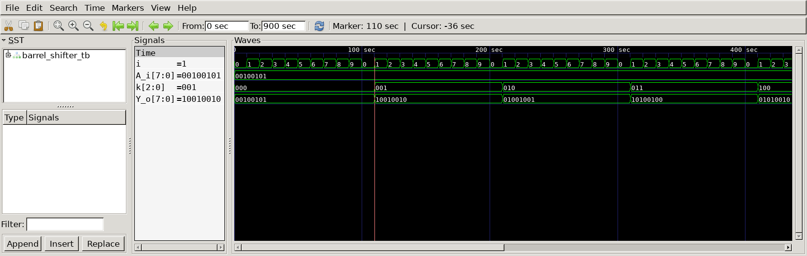

# Gray Code Converter
## Operation Principle
- 8bit Barrel Shifter
- Right rotate
- k: rotate amount
  - k[2] : 4bit rotate
  - k[1] : 2bit rotate
  - k{0] : 1bit rotate

## Verilog Code
### DUT
```Verilog
//---------------------------------------------------
// mux2
//---------------------------------------------------
module mux2 (
	input	in0,
	input	in1,
	input	sel,
	output	out
);

	assign out = (sel)? in1 : in0;
	
endmodule

//---------------------------------------------------
module barrel_shifter(
	input	[2:0] k,
	input	[7:0] A_i,
	output	[7:0] Y_o
);

	wire	[7:0] x_4;
	wire	[7:0] y_2;
//---------------------------------------------------
// 4-bit shift right
//---------------------------------------------------
	mux2
	u_mux2_4bit_0(
		.in0		(A_i[0]		),
		.in1		(A_i[4]		),
		.sel 		(k[2]		),
		.out		(x_4[0]		)
	);

	mux2
	u_mux2_4bit_1(
		.in0		(A_i[1]		),
		.in1		(A_i[5]		),
		.sel 		(k[2]		),
		.out		(x_4[1]		)
	);

	mux2
	u_mux2_4bit_2(
		.in0		(A_i[2]		),
		.in1		(A_i[6]		),
		.sel 		(k[2]		),
		.out		(x_4[2]		)
	);

	mux2
	u_mux2_4bit_3(
		.in0		(A_i[3]		),
		.in1		(A_i[7]		),
		.sel 		(k[2]		),
		.out		(x_4[3]		)
	);

	mux2
	u_mux2_4bit_4(
		.in0		(A_i[4]		),
		.in1		(A_i[0]		),
		.sel 		(k[2]		),
		.out		(x_4[4]		)
	);

	mux2
	u_mux2_4bit_5(
		.in0		(A_i[5]		),
		.in1		(A_i[1]		),
		.sel 		(k[2]		),
		.out		(x_4[5]		)
	);

	mux2
	u_mux2_4bit_6(
		.in0		(A_i[6]		),
		.in1		(A_i[2]		),
		.sel 		(k[2]		),
		.out		(x_4[6]		)
	);

	mux2
	u_mux2_4bit_7(
		.in0		(A_i[7]		),
		.in1		(A_i[3]		),
		.sel 		(k[2]		),
		.out		(x_4[7]		)
	);
//---------------------------------------------------
// 2-bit shift right
//---------------------------------------------------
	mux2
	u_mux2_2bit_0(
		.in0		(x_4[0]		),
		.in1		(x_4[2]		),
		.sel		(k[1]		),
		.out		(y_2[0]		)
	);

	mux2
	u_mux2_2bit_1(
		.in0		(x_4[1]		),
		.in1		(x_4[3]		),
		.sel		(k[1]		),
		.out		(y_2[1]		)
	);

	mux2
	u_mux2_2bit_2(
		.in0		(x_4[2]		),
		.in1		(x_4[4]		),
		.sel		(k[1]		),
		.out		(y_2[2]		)
	);

	mux2
	u_mux2_2bit_3(
		.in0		(x_4[3]		),
		.in1		(x_4[5]		),
		.sel		(k[1]		),
		.out		(y_2[3]		)
	);

	mux2
	u_mux2_2bit_4(
		.in0		(x_4[4]		),
		.in1		(x_4[6]		),
		.sel		(k[1]		),
		.out		(y_2[4]		)
	);

	mux2
	u_mux2_2bit_5(
		.in0		(x_4[5]		),
		.in1		(x_4[7]		),
		.sel		(k[1]		),
		.out		(y_2[5]		)
	);

	mux2
	u_mux2_2bit_6(
		.in0		(x_4[6]		),
		.in1		(x_4[0]		),
		.sel		(k[1]		),
		.out		(y_2[6]		)
	);

	mux2
	u_mux2_2bit_7(
		.in0		(x_4[7]		),
		.in1		(x_4[1]		),
		.sel		(k[1]		),
		.out		(y_2[7]		)
	);
//---------------------------------------------------
// 1-bit shift right
//---------------------------------------------------

	mux2
	u_mux2_1bit_0(
		.in0		(y_2[0]		),
		.in1		(y_2[1]		),
		.sel		(k[0]		),
		.out		(Y_o[0]		)
	);
	mux2
	u_mux2_1bit_1(
		.in0		(y_2[1]		),
		.in1		(y_2[2]		),
		.sel		(k[0]		),
		.out		(Y_o[1]		)
	);
	mux2
	u_mux2_1bit_2(
		.in0		(y_2[2]		),
		.in1		(y_2[3]		),
		.sel		(k[0]		),
		.out		(Y_o[2]		)
	);
	mux2
	u_mux2_1bit_3(
		.in0		(y_2[3]		),
		.in1		(y_2[4]		),
		.sel		(k[0]		),
		.out		(Y_o[3]		)
	);
	mux2
	u_mux2_1bit_4(
		.in0		(y_2[4]		),
		.in1		(y_2[5]		),
		.sel		(k[0]		),
		.out		(Y_o[4]		)
	);
	mux2
	u_mux2_1bit_5(
		.in0		(y_2[5]		),
		.in1		(y_2[6]		),
		.sel		(k[0]		),
		.out		(Y_o[5]		)
	);
	mux2
	u_mux2_1bit_6(
		.in0		(y_2[6]		),
		.in1		(y_2[7]		),
		.sel		(k[0]		),
		.out		(Y_o[6]		)
	);
	mux2
	u_mux2_1bit_7(
		.in0		(y_2[7]		),
		.in1		(y_2[0]		),
		.sel		(k[0]		),
		.out		(Y_o[7]		)
	);

endmodule
```
### Testbench
```Verilog
`define CLKFREQ		100
`define SIMCYCLE	10

`include "barrel_shifter.v"

module	barrel_shifter_tb;
// --------------------------------------------------
//		DUT Signals & Instantiate
// --------------------------------------------------
	reg		[2:0]	k;
	reg 	[7:0]	A_i;
	wire 	[7:0]	Y_o;

	barrel_shifter
	u_barrel_shifter(
		.k		(k		),
		.A_i	(A_i	),
		.Y_o	(Y_o	)
	);

// --------------------------------------------------
//	Tasks
// --------------------------------------------------
	task init;
			begin
				A_i = 0;
				k = 0;
			end
	endtask

// --------------------------------------------------
//	Test Stimulus
// --------------------------------------------------
	integer		i;
	initial begin
		init();

			A_i = 8'b0010_0101;

		for (i=0; i<`SIMCYCLE; i++) begin			//rotate_0
			#(1000/`CLKFREQ);
			k[0] = 0;
			k[1] = 0;
			k[2] = 0;
		end

		for (i=0; i<`SIMCYCLE; i++) begin			//roatate_1
			#(1000/`CLKFREQ);
			k[0] = 1;
			k[1] = 0;
			k[2] = 0;
		end

		for (i=0; i<`SIMCYCLE; i++) begin			//rotate_2
			#(1000/`CLKFREQ);
			k[0] = 0;
			k[1] = 1;
			k[2] = 0;
		end

		for (i=0; i<`SIMCYCLE; i++) begin			//rotate_3
			#(1000/`CLKFREQ);
			k[0] = 1;
			k[1] = 1;
			k[2] = 0;
		end

		for (i=0; i<`SIMCYCLE; i++) begin			//rotate_4
			#(1000/`CLKFREQ);
			k[0] = 0;
			k[1] = 0;
			k[2] = 1;
		end

		for (i=0; i<`SIMCYCLE; i++) begin			//rotate_5
			#(1000/`CLKFREQ);
			k[0] = 1;
			k[1] = 0;
			k[2] = 1;
		end

		for (i=0; i<`SIMCYCLE; i++) begin			//rotate_6
			#(1000/`CLKFREQ);
			k[0] = 0;
			k[1] = 1;
			k[2] = 1;
		end

		for (i=0; i<`SIMCYCLE; i++) begin			//rotate_7
			#(1000/`CLKFREQ);
			k[0] = 1;
			k[1] = 1;
			k[2] = 1;
		end

		for (i=0; i<`SIMCYCLE; i++) begin			//rotate_random
			#(1000/`CLKFREQ);
			k = $urandom;
		end

		$finish;

	end

		
// --------------------------------------------------
//	Dump VCD
// --------------------------------------------------
		reg	[8*32-1:0]	vcd_file;
		initial begin
			if ($value$plusargs("vcd_file=%s", vcd_file)) begin
				$dumpfile(vcd_file);
				$dumpvars;
			end else begin
				$dumpfile("barrel_shifter_tb.vcd");
				$dumpvars;
			end
		end
	
	endmodule
```
## Simulation Result
- A_i = 8'b0010_0101 -> a

