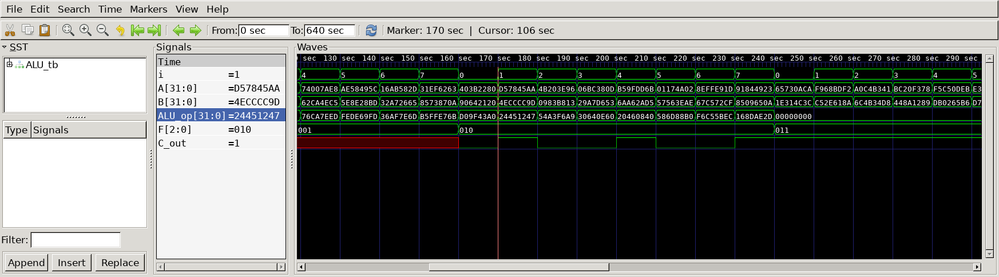

# Arithmetic Logic Unit
## Operation Principle
- Arithmetic Logic Unit Function
	- N = 32


## Verilog Code
## DUT
```Verilog
module ALU
#(
	parameter	N = 32
)
(
	input		[31:0] 	A,
	input		[31:0]	B,
	input		[2:0]	F,
	output reg	C_out,
	output reg	[31:0]	ALU_op
);

always@ (*) begin
	case (F)
		3'b000 : ALU_op 		 = A & B;
		3'b001 : ALU_op 		 = A | B;
		3'b010 : {C_out, ALU_op} = A + B;
		3'b011 : ALU_op 		 = 0;
		3'b100 : ALU_op 		 = A & ~B;
		3'b101 : ALU_op 		 = A | ~B;
		3'b110 : ALU_op 		 = A - B;
		3'b111 : ALU_op 		 = (A > B) ? 0 : 1;

	endcase
end

endmodule
```
### Testbench
```Verilog
`define CLKFREQ		100
`define SIMCYCLE	3

`include "ALU.v"

module ALU_tb;
// --------------------------------------------------
//		DUT Signals & Instantiate
// --------------------------------------------------

	parameter N = 32;

	reg		[31:0]	A;
	reg		[31:0]	B;
	reg		[2:0]	F;
	wire			C_out;
	wire	[31:0]	ALU_op;

	ALU	
	#(
		. N		(N		)
	)
	u_ALU(
		. A		(A		),
		. B		(B		),
		. F		(F		),
		. C_out	(C_out	),
		. ALU_op (ALU_op)
	);

// --------------------------------------------------
//	Task
// --------------------------------------------------
	task init;
		begin
			A = 31'b0;
			B = 31'b0;
			F = 3'b0;
		end
	endtask
	
// --------------------------------------------------
//	Test Stimulus
// --------------------------------------------------
integer i;

initial begin
	init();

	for(i = 0; i<`SIMCYCLE; i++)begin
		F = 3'b000;
		A = $urandom;
		B = $urandom;
		#(1000/`CLKFREQ);
	end

	for(i = 0; i<`SIMCYCLE; i++)begin
		F = 3'b001;
		A = $urandom;
		B = $urandom;
		#(1000/`CLKFREQ);
	end

	for(i = 0; i<`SIMCYCLE; i++)begin
		F = 3'b010;
		A = $urandom;
		B = $urandom;
		#(1000/`CLKFREQ);
	end

	for(i = 0; i<`SIMCYCLE; i++)begin
		F = 3'b011;
		A = $urandom;
		B = $urandom;
		#(1000/`CLKFREQ);
	end

	for(i = 0; i<`SIMCYCLE; i++)begin
		F = 3'b100;
		A = $urandom;
		B = $urandom;
		#(1000/`CLKFREQ);
	end

	for(i = 0; i<`SIMCYCLE; i++)begin
		F = 3'b101;
		A = $urandom;
		B = $urandom;
		#(1000/`CLKFREQ);
	end

	for(i = 0; i<`SIMCYCLE; i++)begin
		F = 3'b110;
		A = $urandom;
		B = $urandom;
		#(1000/`CLKFREQ);
	end

	for(i = 0; i<`SIMCYCLE; i++)begin
		F = 3'b111;
		A = $urandom;
		B = $urandom;
		#(1000/`CLKFREQ);
	end
	$finish;
end

// --------------------------------------------------
//	Dump VCD
// --------------------------------------------------
		reg	[8*32-1:0]	vcd_file;
		initial begin
			if ($value$plusargs("vcd_file=%s", vcd_file)) begin
				$dumpfile(vcd_file);
				$dumpvars;
			end else begin
				$dumpfile("ALU_tb.vcd");
				$dumpvars;
			end
		end
	
	endmodule
```
## Simulation Result



