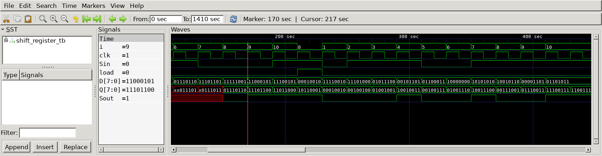

# Gray Code Converter
## Operation Principle
- 8bit Shift Register


## Verilog Code
### DUT
```Verilog
module shift_register
#(
	parameter N = 8
)
(
	input			clk,
	input			load,
	input			Sin,
	input	[N-1:0]	D,
	output	[N-1:0]	Q,
	output			Sout
);

	mux_f 
	u_mux_f_0(
		.clk	(clk		),
		.in0	(Sin		),
		.in1	(D[0]		),
		.sel	(load		),
		.out	(Q[0]		)
	);

	mux_f
	u_mux_f_1(
		.clk	(clk		),
		.in0	(Q[0]		),
		.in1	(D[1]		),
		.sel	(load		),
		.out	(Q[1]		)
	);

	mux_f
	u_mux_f_2(
		.clk	(clk		),
		.in0	(Q[1]		),
		.in1	(D[2]		),
		.sel	(load		),
		.out	(Q[2]		)
	);

	mux_f
	u_mux_f_3(
		.clk	(clk		),
		.in0	(Q[2]		),
		.in1	(D[3]		),
		.sel	(load		),
		.out	(Q[3]		)
	);

	mux_f
	u_mux_f_4(
		.clk	(clk		),
		.in0	(Q[3]		),
		.in1	(D[4]		),
		.sel	(load		),
		.out	(Q[4]		)
	);

	mux_f
	u_mux_f_5(
		.clk	(clk		),
		.in0	(Q[4]		),
		.in1	(D[5]		),
		.sel	(load		),
		.out	(Q[5]		)
	);

	mux_f
	u_mux_f_6(
		.clk	(clk		),
		.in0	(Q[5]		),
		.in1	(D[6]		),
		.sel	(load		),
		.out	(Q[6]		)
	);

	mux_f
	u_mux_f_7(
		.clk	(clk		),
		.in0	(Q[6]		),
		.in1	(D[7]		),
		.sel	(load		),
		.out	(Q[7]		)
	);

	assign Sout = Q[7];

endmodule

//---------------------------------------------------
//mux_f
//---------------------------------------------------
module mux_f (
	input		in0,
	input		in1,
	input		sel,
	input		clk,
	output reg	out
);

	wire		out_mux;

	assign out_mux = (sel) ? in1 : in0;

	always@ (posedge clk) out = out_mux;

endmodule
```
### Testbench
```Verilog
`define CLKFREQ		100
`define	SIMCYCLE	10

`include "shift_register.v"

module shift_register_tb;
// --------------------------------------------------
//		DUT Signals & Instantiate
// --------------------------------------------------
	parameter		N = 8;

	reg				clk;
	reg				load;
	reg				Sin;
	reg  [N-1:0]	D;
	wire [N-1:0]	Q;
	wire			Sout;

	shift_register
	u_shift_register(
		.clk		(clk	),
		.load		(load	),
		.Sin		(Sin	),
		.D			(D		),
		.Q			(Q		),
		.Sout		(Sout	)
	);

// --------------------------------------------------
//	Clock
// --------------------------------------------------
	always	#(1000/`CLKFREQ)
		clk = ~clk;

// --------------------------------------------------
//	Tasks
// --------------------------------------------------
	task init;
		begin
			clk		= 0;
			load	= 0;
			Sin		= 0;
			D		= 0;
		end
	endtask

// --------------------------------------------------
//	Test Stimulus
// --------------------------------------------------
	integer		i;
	initial begin
		init();

		for (i=0; i<`SIMCYCLE; i++) begin		// Serial to Parallel
			@(posedge clk);
			load	= 0;
			D		= $urandom;
			Sin		= $urandom;
		end

			@(posedge clk);					// N-bit register
			load	= 1;
			D		= $urandom;
			Sin		= $urandom;

		for (i=0; i<`SIMCYCLE; i++) begin		// Parallel to Serial
			@(posedge clk);
			load	= 0;
			D		= $urandom;
			Sin		= $urandom;
		end

		#1000;
		$finish;

	end

// --------------------------------------------------
//	Dump VCD
// --------------------------------------------------
		reg	[8*32-1:0]	vcd_file;
		initial begin
			if ($value$plusargs("vcd_file=%s", vcd_file)) begin
				$dumpfile(vcd_file);
				$dumpvars;
			end else begin
				$dumpfile("shift_register_tb.vcd");
				$dumpvars;
			end
		end
	
		endmodule
```
## Simulation Result
- 

