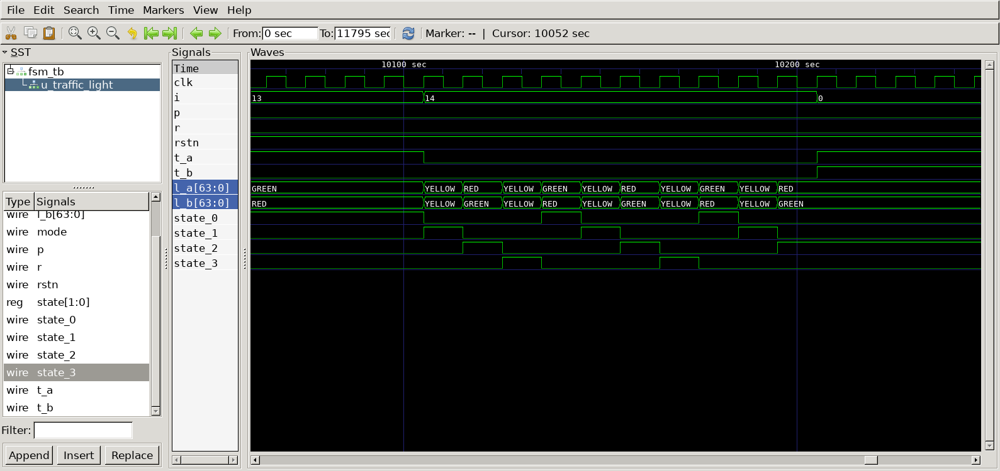

# Arithmetic Logic Unit
## Operation Principle
- Factoring State Machines
- Modify traffic light controller to have Parade Mode
	- Two more inputs : P,R
## Verilog Code
## DUT
```Verilog
module traffic_light
(
	output		[8*8-1 : 0]		l_a,
	output		[8*8-1 : 0]		l_b,
	input						p,
	input						r,
	input						t_a,
	input						t_b,
	input						clk,
	input						rstn
);

wire		mode;
reg	[1:0]	state;
wire		state_0;
wire		state_1;
wire		state_2;
wire		state_3;

assign	mode	=	(r)	? 0 :
					(p)	? 1 : 0;
assign	state_0	=	(state == 0) ? 1 : 0;
assign	state_1	=	(state == 1) ? 1 : 0;
assign	state_2	=	(state == 2) ? 1 : 0;
assign	state_3	=	(state == 3) ? 1 : 0;

assign	l_a	=	(state_0)	?	"GREEN"		:
				(state_1)	?	"YELLOW"	:
				(state_2)	?	"RED"		:
				(state_3)	?	"YELLOW"	:	"GREEN";

assign	l_b	=	(state_0)	?	"RED"		:
				(state_1)	?	"YELLOW"	:
				(state_2)	?	"GREEN"		:
				(state_3)	?	"YELLOW"	:	"RED";

always @(posedge clk or negedge rstn) begin
	if(!rstn) begin
		state	= 0;
	end else begin
		if (mode) begin
			state	<= 2;
		end else begin
			if(state_0 & t_a) begin
				state	<=	0;
			end else begin
				if(state_2 & t_b) begin
					state	<=	2;
				end else begin
					state	<=	state + 1;
				end
			end
		end
	end
end

endmodule
```

### Testbench
```Verilog
`define	SIMCYCLE	15
`define	CLKFREQ		100
`include "traffic_light.v"

module fsm_tb;

	wire	[8*8-1 : 0]		l_a;
	wire	[8*8-1 : 0]		l_b;
	reg						p;
	reg						r;
	reg						t_a;
	reg						t_b;
	reg						clk;
	reg						rstn;

//-------------------------------
//CLK Generate
//-------------------------------
always #(500/`CLKFREQ) clk = ~clk;

//-------------------------------
//Module Instance
//-------------------------------

traffic_light u_traffic_light
(
	.l_a 		(	l_a 		),
	.l_b 		(	l_b 		),
	.p   		(	p   		),
	.r   		(	r   		),
	.t_a 		(	t_a 		),
	.t_b 		(	t_b 		),
	.clk 		(	clk 		),
	.rstn     	(	rstn	 	)
);
//-------------------------------
//Tasks
//-------------------------------
task init;
	begin
		p	= 0;
		r	= 0;
		t_a	= 0;
		t_b	= 0;
        clk 		= 0;
        rstn		= 1;
			
		@(posedge clk);
		rstn	= 0;

		repeat(20) begin
			@(posedge clk);
		end
		
        rstn	= 1;

	end
endtask
//-------------------------------
//Test Start
//-------------------------------
integer i;
	initial begin
		init();
			repeat(100)
			@(posedge clk);
			p = 1;
			repeat(200)
			@(posedge clk);
			r = 1;
			repeat(100)
			@(posedge clk);
			t_a = 1;
			repeat(100)
			@(posedge clk);
			t_a = 0;
			t_b = 1;
			repeat(100)
			@(posedge clk);
			t_b = 0;
			repeat(100)
			@(posedge clk);
			for(i=0;i<`SIMCYCLE;i++) begin
				p		=	$urandom;
				r		=	$urandom;
				#(10000/`CLKFREQ);
			end			
				p		=	0;
				r		=	0;
			for(i=0;i<`SIMCYCLE;i++) begin
				t_a		=	$urandom;
				t_b		=	$urandom;
				#(10000/`CLKFREQ);
			end			
				t_a		=	0;
				t_b		=	0;
			for(i=0;i<`SIMCYCLE;i++) begin
				p		=	$urandom;
				r		=	$urandom;
				t_a		=	$urandom;
				t_b		=	$urandom;
				#(10000/`CLKFREQ);
			end			
			repeat(10)
			@(posedge clk);
			$finish;
		end

//-------------------------------
//Dump VCD
//-------------------------------
reg [8*32-1:0]	vcd_file;
	initial begin
		if ($value$plusargs("vcd_file=%s", vcd_file)) begin
			$dumpfile(vcd_file);
			$dumpvars;
		end else begin
			$dumpfile("fsm_tb.vcd");
			$dumpvars;
		end
	end
endmodule
```
## Simulation Result

