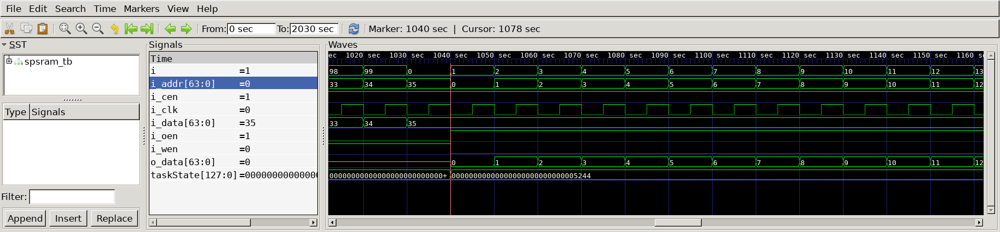

# Gray Code Converter
## Operation Principle
- SRAM Extension
- SRAM Unit
	- 4bit Adder & 32bit I/O Data -> 6bit Adder & 64bit I/O Data

## Verilog Code
### DUT - spsram
```Verilog
module spsram
#(
	parameter	BW_DATA = 32,
	parameter	BW_ADDR = 4
)
(
	output		[BW_DATA-1:0]	o_data,
	input		[BW_DATA-1:0]	i_data,
	input		[BW_ADDR-1:0]	i_addr,
	input						i_wen,
	input						i_cen,
	input						i_oen,
	input						i_clk
);

//Memory Write
reg		[BW_DATA-1:0]	mem[0:2**BW_ADDR-1];
always @(posedge i_clk) begin
	if(i_cen && i_wen) begin
		mem[i_addr] <= i_data;
	end else begin
		mem[i_addr] <= mem[i_addr];
	end
end

//Memory Read
`ifdef	SPSRAM_ASYNC
	assign	o_data = !i_oen			 ?	'bz :
					 i_cen && !i_wen ? mem[i_addr] : 'bx;

`else
	reg		[BW_DATA-1:0]	o_data;
	always @(posedge i_clk) begin
		if(i_oen) begin
			if(i_cen && !i_wen) begin
				o_data <= mem[i_addr];
			end else begin
				o_data <= 'bx;
			end
		end else begin
			o_data <= 'bz;
		end
	end
`endif

endmodule
```
## Verilog Code
### DUT - spsram_ext
```Verilog
`include "spsram.v"

module sram_extension
#(
	parameter	BW_DATA = 64,
	parameter	BW_ADDR	= 6
)
(
	input		[BW_DATA-1:0] 	i_data,
	input		[BW_DATA-1:0]	i_addr,
	input						i_wen,
	input						i_cen,
	input						i_oen,
	input						i_clk,
	ouput		[BW_DATA-1:0]	o_data
);

	wire	add_00, add_01, add_10, add_11;

	assign	add_00 = (i_addr[5:4] == 2'b00);
	assign	add_01 = (i_addr[5:4] == 2'b01);
	assign	add_10 = (i_addr[5:4] == 2'b10);
	assign	add_11 = (i_addr[5:4] == 2'b11);
spsram	
#(
	.BW_DATA		(32	),
	.BW_ADDR		(4	)
)
u_spsram_0(
	.o_data			(o_data[63:32]	),
	.i_data			(i_data[63:32]	),
	.i_addr			(i_addr[3:0]	),
	.i_wen			(i_wen			),
	.i_cen			(i_cen && add_00),
	.i_oen			(i_oen && add_00),
	.i_clk			(i_clk			)
);

spsram	
#(
	.BW_DATA		(32	),
	.BW_ADDR		(4	)
)
u_spsram_1(
	.o_data			(o_data[31:0]	),
	.i_data			(i_data[31:0]	),
	.i_addr			(i_addr[3:0]	),
	.i_wen			(i_wen			),
	.i_cen			(i_cen && add_00),
	.i_oen			(i_oen && add_00),
	.i_clk			(i_clk			)
);

spsram	
#(
	.BW_DATA		(32	),
	.BW_ADDR		(4	)
)
u_spsram_2(
	.o_data			(o_data[63:32]	),
	.i_data			(i_data[63:32]	),
	.i_addr			(i_addr[3:0]	),
	.i_wen			(i_wen			),
	.i_cen			(i_cen && add_01),
	.i_oen			(i_oen && add_01),
	.i_clk			(i_clk			)
);


spsram	
#(
	.BW_DATA		(32	),
	.BW_ADDR		(4	)
)
u_spsram_3(
	.o_data			(o_data[31:0]	),
	.i_data			(i_data[31:0]	),
	.i_addr			(i_addr[3:0]	),
	.i_wen			(i_wen			),
	.i_cen			(i_cen && add_01),
	.i_oen			(i_oen && add_01),
	.i_clk			(i_clk			)
);

spsram	
#(
	.BW_DATA		(32	),
	.BW_ADDR		(4	)
)
u_spsram_4(
	.o_data			(o_data[63:32]	),
	.i_data			(i_data[63:32]	),
	.i_addr			(i_addr[3:0]	),
	.i_wen			(i_wen			),
	.i_cen			(i_cen && add_10),
	.i_oen			(i_oen && add_10),
	.i_clk			(i_clk			)
);

spsram	
#(
	.BW_DATA		(32	),
	.BW_ADDR		(4	)
)
u_spsram_5(
	.o_data			(o_data[31:0]	),
	.i_data			(i_data[31:0]	),
	.i_addr			(i_addr[3:0]	),
	.i_wen			(i_wen			),
	.i_cen			(i_cen && add_10),
	.i_oen			(i_oen && add_10),
	.i_clk			(i_clk			)
);

spsram	
#(
	.BW_DATA		(32	),
	.BW_ADDR		(4	)
)
u_spsram_6(
	.o_data			(o_data[63:32]	),
	.i_data			(i_data[63:32]	),
	.i_addr			(i_addr[3:0]	),
	.i_wen			(i_wen			),
	.i_cen			(i_cen && add_11),
	.i_oen			(i_oen && add_11),
	.i_clk			(i_clk			)
);

spsram	
#(
	.BW_DATA		(32	),
	.BW_ADDR		(4	)
)
u_spsram_7(
	.o_data			(o_data[31:0]	),
	.i_data			(i_data[31:0]	),
	.i_addr			(i_addr[3:0]	),
	.i_wen			(i_wen			),
	.i_cen			(i_cen && add_11),
	.i_oen			(i_oen && add_11),
	.i_clk			(i_clk			)
);

endmodule
```
### Testbench
```Verilog
`define CLKFREQ		100
`define SIMCYCLE	100
`define BW_DATA		64
`define BW_ADDR		6

`define	SPSRAM_ASYNC

//-----------------------------------------------
//Includes
//-----------------------------------------------
`include	"spsram.v"

module spsram_tb;

//-----------------------------------------------
// DUT Signals & Instantlate
//-----------------------------------------------
wire	[`BW_DATA-1:0]	o_data;
reg		[`BW_DATA-1:0]	i_data;
reg		[`BW_DATA-1:0]	i_addr;
reg						i_wen;
reg						i_cen;
reg						i_oen;
reg						i_clk;

spsram	
#(
	.BW_DATA		(`BW_DATA	),
	.BW_ADDR		(`BW_ADDR	)
)
u_spsram_0(
	.o_data			(o_data		),
	.i_data			(i_data		),
	.i_addr			(i_addr		),
	.i_wen			(i_wen		),
	.i_cen			(i_cen		),
	.i_oen			(i_oen		),
	.i_clk			(i_clk		)
);

spsram	
#(
	.BW_DATA		(`BW_DATA	),
	.BW_ADDR		(`BW_ADDR	)
)
u_spsram_1(
	.o_data			(o_data		),
	.i_data			(i_data		),
	.i_addr			(i_addr		),
	.i_wen			(i_wen		),
	.i_cen			(i_cen		),
	.i_oen			(i_oen		),
	.i_clk			(i_clk		)
);
spsram	
#(
	.BW_DATA		(`BW_DATA	),
	.BW_ADDR		(`BW_ADDR	)
)
u_spsram_2(
	.o_data			(o_data		),
	.i_data			(i_data		),
	.i_addr			(i_addr		),
	.i_wen			(i_wen		),
	.i_cen			(i_cen		),
	.i_oen			(i_oen		),
	.i_clk			(i_clk		)
);
spsram	
#(
	.BW_DATA		(`BW_DATA	),
	.BW_ADDR		(`BW_ADDR	)
)
u_spsram_3(
	.o_data			(o_data		),
	.i_data			(i_data		),
	.i_addr			(i_addr		),
	.i_wen			(i_wen		),
	.i_cen			(i_cen		),
	.i_oen			(i_oen		),
	.i_clk			(i_clk		)
);

always	#(500/`CLKFREQ)		i_clk = ~i_clk;

//Tasks
reg		[4*32-1:0] taskState;

task init;
	begin
		i_data = 0;
		i_addr = 0;
		i_wen  = 0;
		i_cen  = 0;
		i_oen  = 0;
		i_clk  = 0;
	end

endtask

task memWR;
	input	[`BW_ADDR-1:0]	ti_addr;
	input	[`BW_ADDR-1:0]	ti_data;
	begin
		@(negedge i_clk)begin
			taskState	= "WR";
			i_data	= ti_data;
			i_addr	= ti_addr;
			i_wen	= 1;
			i_cen	= 1;
			i_oen	= 0;
		end
	end
endtask

task memRD;
	input	[`BW_ADDR-1:0] ti_addr;
	begin
		@(negedge i_clk) begin
			taskState	= "RD";
			i_addr = ti_addr;
			i_wen = 0;
			i_cen = 1;
			i_oen = 1;
			end
		end
	endtask


//Test Stimulus
integer	i,j;
initial begin
	init();
	#(4*1000/`CLKFREQ);

	for (i=0; i<`SIMCYCLE; i++) begin
		memWR(i, i);
	end
	for (i=0; i<`SIMCYCLE; i++) begin
		memRD(i);
	end
	$finish;
end

//Dump VCD
reg [8*32-1:0] vcd_file;
initial begin
	if($value$plusargs("vcd_file=%s", vcd_file)) begin
		$dumpfile(vcd_file);
		$dumpvars;
	end else begin
		$dumpfile("spsram_tb.vcd");
		$dumpvars;
	end
end

endmodule
```
## Simulation Result
- signal Read -> o_data change


